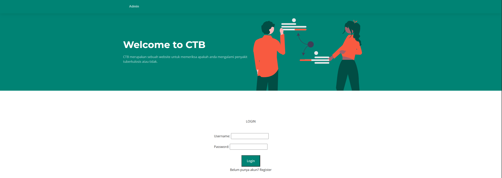
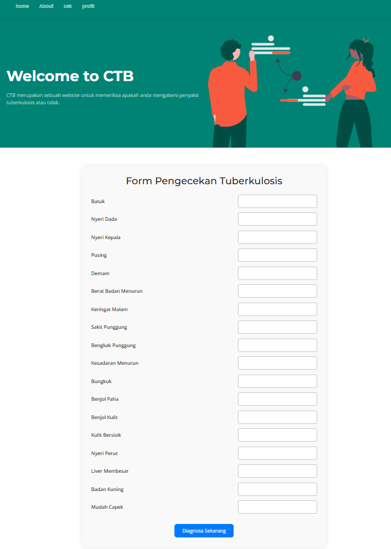
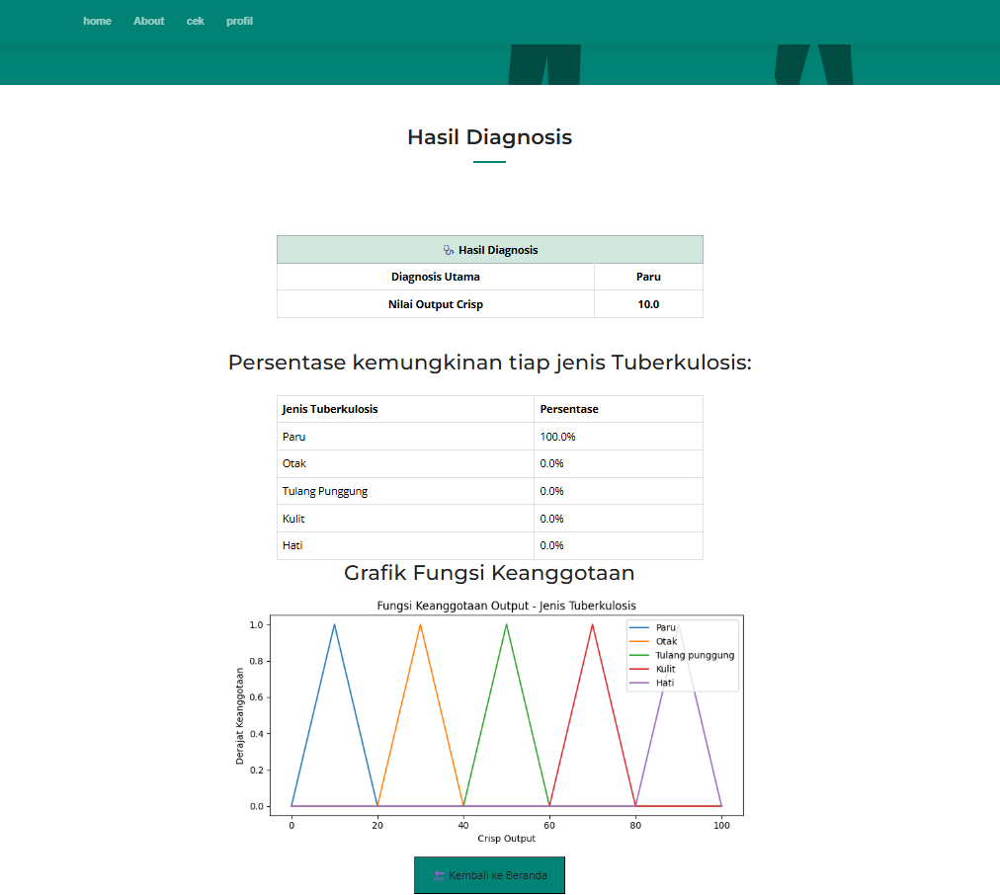
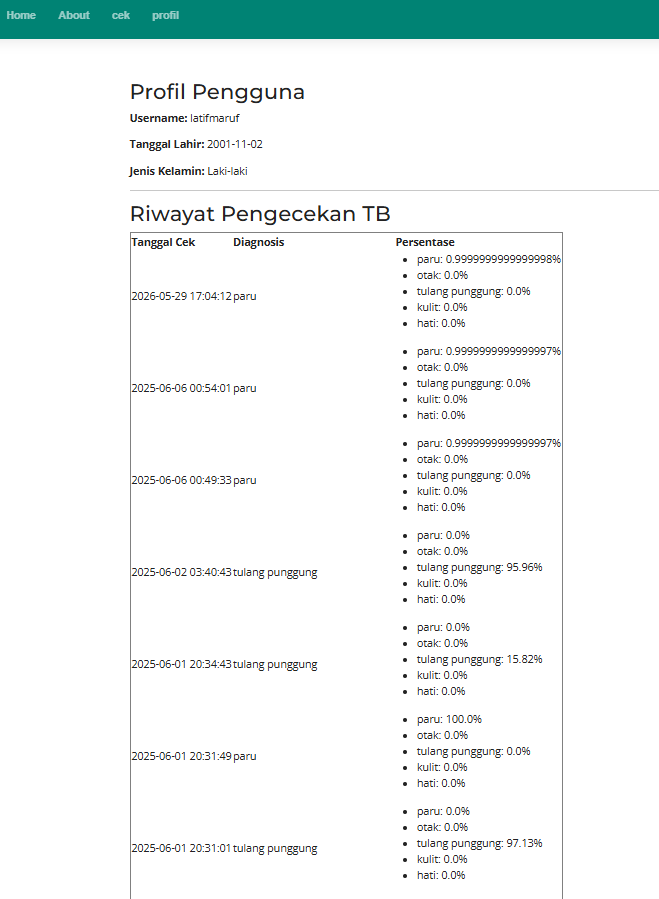

#sistem diagnosa tuberkulosis

#fitur
- User Registration
- Login/logout
- Input gejala
- Hasil diagnosa,
- Database penyimpanan

#Technologies Used
- Python
- Flask
- SQLite
- HTML/CSS
- Bootstrap

#Project Structure
```bash
tb-diagnosis-system/
│
├── assets/
├── static/
├── templates/
│
├── app.py
├── database.db
├── gejala.xlsx
├── penyakit.xlsx
```

## Installation

Clone repository:

```bash
git clone https://github.com/LatifMauruf/aplikasi_diagnosa_tuberkulosis.github.io.git
```

Move to project folder:

```bash
cd tb-diagnosis-system
```

Install dependencies:

```bash
pip install -r requirements.txt
```

Run application:

```bash
python app.py
```

---

## Authentication Features

- User registration system
- Secure login & logout
- Session management

---

## Diagnosis System

The application processes symptom data input by users and provides tuberculosis diagnosis results based on predefined disease and symptom datasets.

---

## Screenshots

### Login Page


### Registration Page


### Diagnosis Page


### Result Page


---

## Author

Latif Ma'ruf
